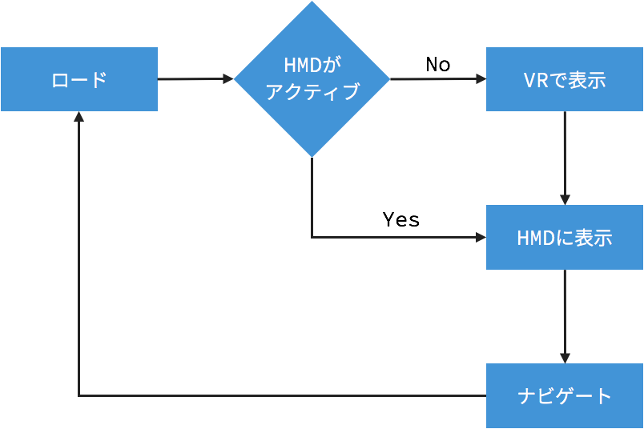

<!-- .slide: data-background="media/img/aframe.jpg" -->

<div class="talk-title">
  <h1>WebVR とそれを支える技術</h1>
  <p>  
    Mozilla Japan 清水智公 | @chikoski
  </p>
</div>

---

<blockquote class="twitter-tweet" data-lang="en"><p lang="en" dir="ltr">I made some <a href="https://twitter.com/hashtag/webvr?src=hash">#webvr</a> fireworks for tonights NYE celebration. Check it out at <a href="https://t.co/Eedi71bXor">https://t.co/Eedi71bXor</a> ! <a href="https://t.co/gGVgTUJW8o">pic.twitter.com/gGVgTUJW8o</a></p>&mdash; Casey Yee (@whoyee) <a href="https://twitter.com/whoyee/status/815393296335765504">January 1, 2017</a></blockquote>
<script async src="//platform.twitter.com/widgets.js" charset="utf-8"></script>

---

## VR コンテンツ流通の障壁

<div class="captioned-image-row">
  <div>
    
    <i>Gatekeeper</i>
  </div>
  <div>
    
    <i>Installation</i>
  </div>
  <div>
    
    <i>Closed</i>
  </div>
</div>

---

## WebVR：**Web** の特徴を活用した VR プラットフォーム

<div class="captioned-image-row">
  <div>
    
    <i>Open</i>
  </div>
  <div>
    
    <i>Connected</i>
  </div>
  <div>
    
    <i>Instant</i>
  </div>
</div>

---

<iframe class="stretch" src="http://www.360syria.com/intro"></iframe>

---

<!-- .slide: data-background-video="media/video/a-painter.mp4" data-background-video-muted="true" data-state="state--bg-dark" -->

## A-Painter

[Live demo](https://aframe.io/a-painter/)

<!-- NOTES -->
- A-Frame is very powerful
- 90+fps room-scale TiltBrush experience in a few weeks with just A-Frame

---


https://w3c.github.io/webvr/

----

<div class="captioned-image-row">
  <div>
    
    <i>Firefox Nightly</i>
  </div>
  <div>
    
    <i>Chromium (Experimental)</i>
  </div>
  <div>
    
    <i>Samsung Internet</i>
  </div>
  <div>
    
    <i>Microsoft Edge</i>
  </div>
  <div>
    
    <i>Mobile Polyfill</i>
  </div>
</div>

https://iswebvrready.com

<!-- NOTES -->
- Firefox + Chrome WebVR 1.0 hits release channels early 2017
- Currently behind Nightly, custom builds, and flags
- Mobile Polyfill: use device motion / orientation sensors to polyfill on smartphones
- With all the browsers behind it...

----

### HMD の取得

~~~javascript
const canvas = document.querySelector("canvas");
navigator.getVRDisplays()
   .then(displayList => {
      if(!displayList.length || displayList[0].isPresenting){
         return Promise.reject(displayList);
      }
      return Promise.resolve(displayList[0])
    })
   .then(display => display.requestPresent({source: canvs}))
   .then(display => enterVR(display));
~~~

----

### アニメーションループ

~~~javascript
function enterVR(display){
  const update = () => {
    display.requestAnimationFrame(update);
    display.getFrameData(frameData);
    const pose = display.getPose(); // 位置と向きのデータを持つオブジェクトを取得
    const position = pose.position; // 現在の位置を取得
    const orientation = pose.orientation; // 現在の向きを取得
    const x = position[0];
    const orientationX = orientation[0];     
     // 描画
     display.submitData();
  };
  display.requestAnimationFrame(update);
}
~~~

---

## Link traversal

<iframe class="stretch" src="https://321c4.github.io/aframe-link-demo/"></iframe>

----



`window.location.href` を利用してページを遷移

----

~~~javascript
var canvas = document.querySelector('canvas#vr-canvas');

navigator.vr.getReferringDisplays().then(displays => {  
  if (!displays.length || displays[0].isPresenting) {
    return;
  }
  return displays[0].requestPresent([
    {source: canvas}
  ]).then(
    enterVR(display)
  );
});
~~~

----

~~~javascript
// Detect a VR display is available and accessible (e.g., permissions) on the user’s system.
var vrButton = document.querySelector('button#vr-button');  
vrButton.disabled = true;

navigator.vr.getAvailability().then(function (isAvailable) {  
  vrButton.disabled = !isAvailable;
});

navigator.vr.addEventListener('availabilitychange', function (event) {  
  vrButton.disabled = !e.value;
});

// Present content to the first available VR display.
navigator.vr.requestDisplays().then(function (displays) {  
  if (!displays.length || !displays[0].isPresenting) {
    return;
  }
  return displays[0].requestPresent([
    {source: canvas}
  ]).then(
    enterVR(display)
  );
});
~~~

---

<!-- .slide: data-background-video="media/video/boilerplate.mp4" data-state="state--bg-dark" -->

<div class="slide__boilerplate">
  <p>Import WebVR polyfill</p>
  <p>Set up camera</p>
  <p>Set up lights</p>
  <p>Initialize scene</p>
  <p>Declare and pass canvas</p>
  <p>Listen to window resize</p>
  <p>Install VREffect</p>
  <p>Instantiate renderer</p>
  <p>Create render loop</p>
  <p>Preload assets</p>
  <p>Figure out responsiveness</p>
  <p>Deal with metatags and mobile</p>
</div>

<!-- NOTES -->
- It's still too difficult to create WebVR experiences
- Huge obstacle if doing small prototypes and experiments
- Boilerplate needs updating with new versions of WebVR, three.js, and browser quirks
- Encapsulate all of that into one line...

---

## Hello world with A-Frame

<!-- .slide: data-background="media/img/aframe.png" data-transition="fade-in slide-out" -->

```html
<html>
  <script src="https://aframe.io/releases/0.3.2/aframe.min.js"></script>
  <a-scene>
    <a-box color="#4CC3D9" position="-1 0.5 -3" rotation="0 45 0"></a-box>
    <a-cylinder color="#FFC65D" position="1 0.80 -3" radius="0.5" height="1.5"></a-cylinder>
    <a-sphere color="#EF2D5E" position="0 1.25 -5" radius="1.25"></a-sphere>
    <a-plane color="#7BC8A4" position="0 0 -4" rotation="-90 0 0" width="4" height="4"></a-plane>
    <a-sky color="#ECECEC"></a-sky>
  </a-scene>
</html>
```
<!-- .element: class="stretch" -->

<!-- NOTES -->
- Basic 3D primitives with Custom Elements
- Readable: HTML arguably most accessible language in computing
- Encapsulated: copy-and-paste HTML anywhere else and still work, no state or variables
- Quickly look at a live example...

---

<!-- .slide: data-background="media/img/aframe.jpg" -->

<div class="captioned-image-row">
  <div>
    
    <i>d3.js</i>
  </div>
  <div>
    
    <i>Vue.js</i>
  </div>
  <div>
    
    <i>React</i>
  </div>
  <div>
    
    <i>Redux</i>
  </div>
  <div>
    
    <i>jQuery</i>
  </div>
  <div>
    
    <i>Angular</i>
  </div>
</div>

<!-- NOTES -->

- Based on HTML, compatible with all existing libraries/frameworks
- Good reason to have HTML as an intermediary layer between WebGL/three.js
- All tools were on top of the notion of HTML
- Under the hood, A-Frame is an extensible, declarative framework for three.js...

---

# Entity - Component system

<!-- .slide: data-background="media/img/minecraft-blocks.png" -->

<!-- NOTES -->
- Is an entity-component framework
- Popular in game development, used by Unity
- All objects in scene are **entities** that inherently empty objects. Plug in
  **components** to attach appearance / behavior / functionality
- Not going to go into detail about the syntax for this
- 2D web where every element was fixed
- 3D/VR is different, objects of infinite types and complexities, need an easy way to build up different kinds of objects

----

<!-- .slide: data-background="media/img/minecraft-blocks.png" data-transition="slide-in none" -->

```html
<a-entity>
```
<!-- .element: class="stretch" -->

<!-- NOTES -->
- Start with an `<a-entity>`
- By itself, has no appearance, behavior, functionality
- Plug in components to add appearance, behavior, functionality

----

<!-- .slide: data-background="media/img/minecraft-blocks.png" data-transition="none" -->

```html
<a-entity
  geometry="primitive: sphere; radius: 1.5"
  material="color: #343434; roughness: 0.4; sphericalEnvMap: #texture">
```
<!-- .element: class="stretch" -->

----

<!-- .slide: data-background="media/img/minecraft-blocks.png" data-transition="none" -->

```html
<a-entity
  geometry="primitive: sphere; radius: 1.5"
  material="color: #343434; roughness: 0.4; sphericalEnvMap: #texture"
  position="-1 2 4" rotation="45 0 90" scale="2 2 2">
```
<!-- .element: class="stretch" -->

----

<!-- .slide: data-background="media/img/minecraft-blocks.png" data-transition="none" -->

```html
<a-entity
  geometry="primitive: sphere; radius: 1.5"
  material="color: #343434; roughness: 0.4; sphericalEnvMap: #texture"
  position="-1 2 4" rotation="45 0 90" scale="2 2 2"
  animation="property: rotation; loop: true; to: 0 360 0"
  movement-pattern="type: spline; speed: 4">
```
<!-- .element: class="stretch" -->

----

<!-- .slide: data-background="media/img/minecraft-blocks.png" data-transition="none" -->

```html
<a-entity
  json-model="src: #robot"
  position="-1 2 4" rotation="45 0 90" scale="2 2 2"
  animation="property: rotation; loop: true; to: 0 360 0"
  movement-pattern="type: spline; speed: 4">
```
<!-- .element: class="stretch" -->

----

<!-- .slide: data-background="media/img/minecraft-blocks.png" data-transition="none" -->

```html
<a-entity
  json-model="src: #robot"
  position="-1 2 4" rotation="45 0 90" scale="2 2 2"
  animation="property: rotation; loop: true; to: 0 360 0"
  movement-pattern="type: attack; target: #player"
  explode="on: hit">
```
<!-- .element: class="stretch" -->

---

## コンポーネントの作成

<!-- .slide: data-background="media/img/minecraft-blocks.png" data-transition="none" -->

```js
AFRAME.registerComponent('mycomponent', {
  schema: {
    foo: {type: 'selector'},
    bar: {default: 256}
  },

  init: function () { // ... },
  update: function () { // ... },
  remove: function () { // ... },
  tick: function () { // ... },
  pause: function () { // ... },
  play: function () { // ... }
});
```
<!-- .element: class="stretch" -->

```html
<a-box mycomponent="foo: #box; bar: 300"></a-box>
```

<!-- NOTES -->
- Can do anything within a component (full access to three.js, JavaScript, APIs) can get
  exposed declaratively
- `schema`: defines how data is parsed from HTML
- Lifecycle methods:
  - `init`: component attached, like `componentDidMount`
  - `update`: component data update, like `componentWillReceiveProps`
  - `remove`: component detached, like `componentWillUnmount`
  - `tick`: run on every frame
- Properties:
  - `el`: reference to entity element
  - `data`: component data parsed from HTML
  - `object3D`: three.js object

---

<!-- .slide: data-background="media/img/standard-components.png" data-background-size="contain" -->

<!-- NOTES -->
- These are some components that ship with A-Frame
- A-Frame is fully extensible at its core so...

---

<!-- .slide: data-background="media/img/community-components.png" data-background-size="contain" -->

<!-- NOTES -->
- the community has filled the ecosystem with tons of components
- Components can do whatever they want, have full access to three.js and Web APIs
- The component ecosystem the lifeblood of A-Frame
- Physics, leap motion, particle systems, audio visualizations, oceans
- Drop these components as script tags and use them straight from HTML
- Advanced developers empowering other developers
- Working on collecting these components...

---

<div class="icon-title">
  
  <h2>コンポーネントレジストリー</h2>
</div>

<!-- .slide: data-background="media/img/aframe-side.png" -->

<a class="stretch" href="https://aframe.io/aframe-registry">
  <video loop data-src="media/video/registrypreview.mp4" data-autoplay></video>
</a>

<!-- NOTES -->
- Collecting them into the A-Frame registry
- Like a store of components that we make sure work well
- People can browse and search for components or install them....

---

## インスペクター

<!-- .slide: data-background="media/img/inspector.png" data-state="state--bg-dark" -->

`<ctrl>+<alt>+i` で起動できます

<div class="stretch" data-aframe-scene="scenes/80s.html"></div>

---

# aframe.io

<div class="captioned-image-row">
  <div>
    
    <i>80 contributors 4000 stargazers</i>
  </div>
  <div>
    
    <i>2000 members</i>
  </div>
  <div>
    
    <i>Hundreds projects</i>
  </div>
</div>

<!-- NOTES -->
- Open source and inclusive project
- Most work done on GitHub
- Active community on Slack to share projects, interact, hang out, seek help
- Featured projects on the `awesome-aframe` repository and *A Week of A-Frame* blog
